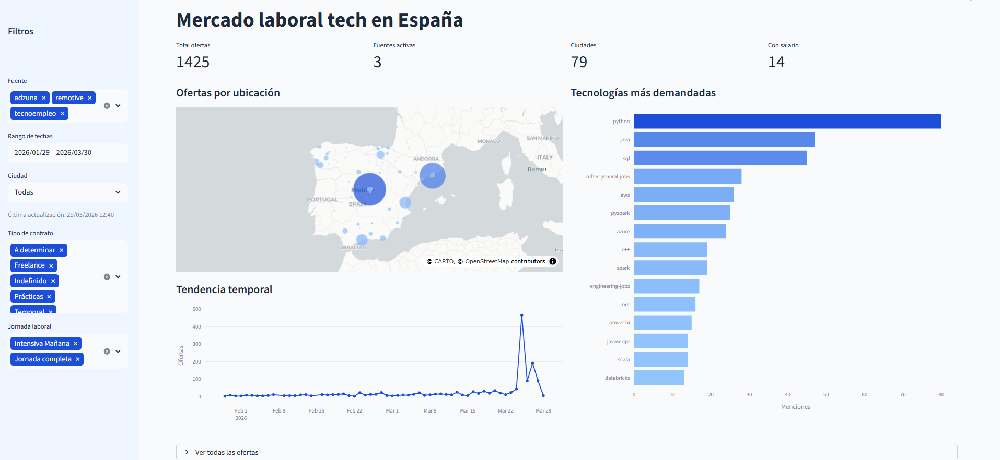

# Tech Job Market Pipeline 

Pipeline ETL end-to-end para extracción, transformación y análisis del mercado laboral tech en España. Combina datos de múltiples fuentes heterogéneas en una base de datos PostgreSQL y los visualiza en un dashboard interactivo Streamlit. 
La extracción de las distintas fuentes se realiza tanto por consultas a su API pública como por webscraping para aquellas que no dispongan de API. 



---

## Arquitectura utilizada

[Adzuna API] [Remotive API] + [Tecnoempleo scraping]

[Extracción - requests / BeautifulSoup]
                      
[Transformación - Pandas / normalización de variables] + [Geocodificación de ubicaciones -Geopy-]
                      
[Carga en BD PostgreSQL - Docker / acceso desde DBeaver]
                      
[Dashboard - Streamlit + Plotly]


---

## Stack tecnológico

| Capa | Tecnologías |
|---|---|
| Extracción | Python, Requests, BeautifulSoup |
| Transformación | Pandas |
| Almacenamiento | PostgreSQL, SQLAlchemy, Docker |
| Geocodificación | Geopy / Nominatim |
| Visualización | Streamlit, Plotly |
| Control de versiones | Git, GitHub |

---

## Fuentes de datos

| Fuente | Tipo | Cobertura |
|---|---|---|
| Adzuna | API REST | Mercado general España |
| Tecnoempleo | Web scraping | Portal tech español |
| Remotive | API REST | Ofertas remote internacionales |

---

## Decisiones técnicas destacadas

- **Arquitectura extensible** - clase base abstracta 'BaseExtractor' que define el contrato de todos los extractores. Añadir una nueva fuente es crear un archivo nuevo de extracción y añadirlo a la lista de extractores del pipeline. 
- **Deduplicación** - constraint 'UNIQUE (source, external_id)' en PostgreSQL con 'ON CONFLICT DO NOTHING'. El pipeline ignora ofertas ya vistas, evitando la carga de datos de manera duplicada.
- **Normalización multi-fuente** - el transformador unifica campos inconsistentes entre fuentes (idioma, formato de fechas, tipos de contrato) a un esquema común.
- **Geocodificación cacheada** - las coordenadas se calculan una vez por ciudad y se persisten en la BD. Las ejecuciones posteriores no repiten peticiones a Nominatim.
- **Filtro temporal** - 'max_days_old=120' en Adzuna para evitar ofertas antiguas que distorsionen el análisis.

---

## Limitaciones conocidas

- Las descripciones de Adzuna están truncadas por diseño de su API
- Cobertura de salario muy baja (~1%) - refleja la realidad del mercado laboral español, que tiende a tratar el salario como un tema tabú
- Remotive tiene volumen reducido de ofertas por keyword


---

## Instrucciones de uso

### Requisitos
- Python 3.10+
- Docker Desktop
- Credenciales API de Adzuna

### Pasos
```bash
# 1. Clonación del repositorio
git clone git@github.com:manuelpalasanchez/proyecto-job-market-pipeline.git
cd proyecto-job-market-pipeline

# 2. Creación del entorno virtual e instalación de dependencias
python -m venv .venv
.venv\Scripts\activate  # Windows
pip install -r requirements.txt

# 3. Configuración de variables de entorno
cp .env.ejemplo .env
# Editar .env con tus credenciales

# 4. Levantar contenedor docker con PostgreSQL
docker compose up -d

# 5. Ejecución del el pipeline
python pipeline.py

# 6. Lanzamiento del dashboard
streamlit run dashboard/app.py
```

---

## Estructura del proyecto
```
proyecto-job-market-pipeline/
-extractors/
   -base_extractor.py           # Contrato abstracto para los extractores
   -adzuna_extractor.py         # Extractor API Adzuna
   -remotive_extractor.py       # Extractor API Remotive
   -tecnoempleo_extractor.py    # Scraper Tecnoempleo
-transformers/
       -job_transformer.py       # Limpieza y normalización 
-loaders/
       -postgres_loader.py       # Carga a PostgreSQL
-utils/
       -geocoder.py              # Geocodificación de ciudades 
-dashboard/
       -app.py                   # App dashboard con Streamlit
-database/
       -schema.sql               # Esquema de datos PostgreSQL
-docker-compose.yml
-pipeline.py                    # Orquestador principal del flujo
-requirements.txt